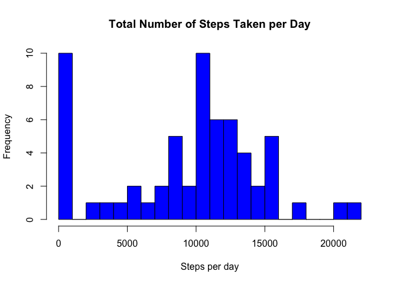
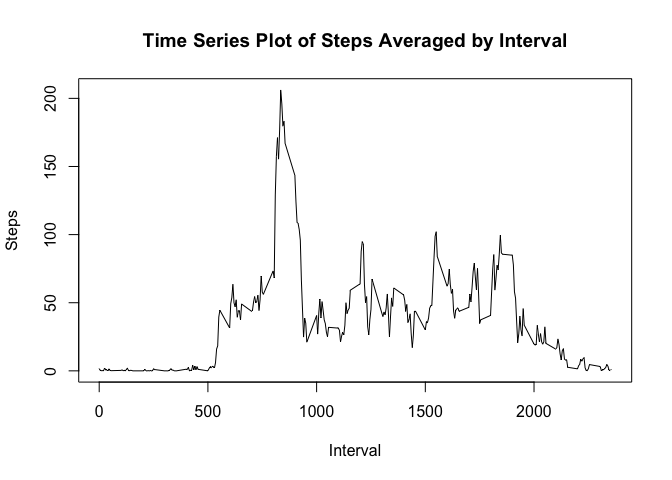
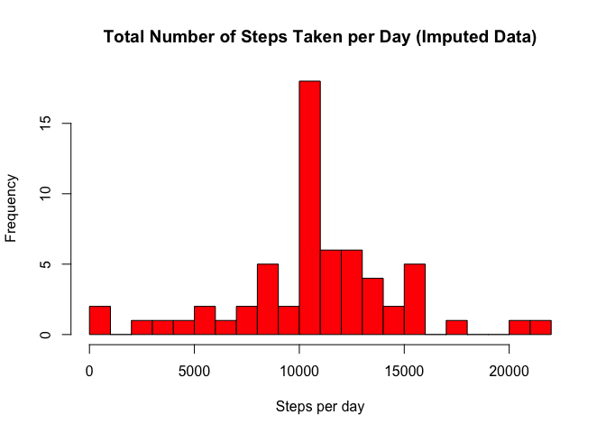
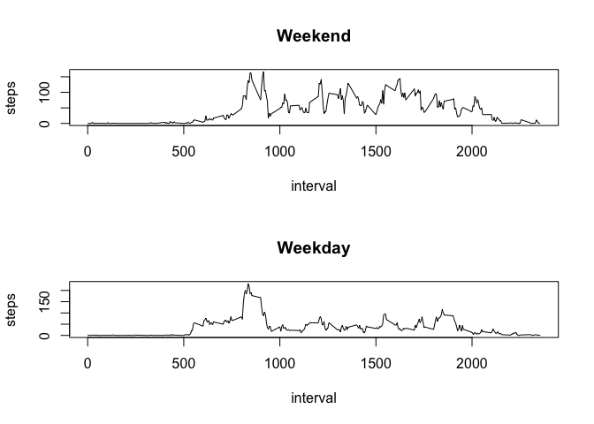

# Reproducible Research: Peer Assessment 1


## Loading and preprocessing the data

Firstly, let's download out data from a personal activity monitoring device and look at first 6 rows of this data.


```r
data = read.csv('activity.csv', header = TRUE)
#data$date <- as.Date(data$date)
head(data)
```

```
##   steps       date interval
## 1    NA 2012-10-01        0
## 2    NA 2012-10-01        5
## 3    NA 2012-10-01       10
## 4    NA 2012-10-01       15
## 5    NA 2012-10-01       20
## 6    NA 2012-10-01       25
```

Let's now look at the summary of our data.


```r
summary(data)
```

```
##      steps                date          interval     
##  Min.   :  0.00   2012-10-01:  288   Min.   :   0.0  
##  1st Qu.:  0.00   2012-10-02:  288   1st Qu.: 588.8  
##  Median :  0.00   2012-10-03:  288   Median :1177.5  
##  Mean   : 37.38   2012-10-04:  288   Mean   :1177.5  
##  3rd Qu.: 12.00   2012-10-05:  288   3rd Qu.:1766.2  
##  Max.   :806.00   2012-10-06:  288   Max.   :2355.0  
##  NA's   :2304     (Other)   :15840
```

As we can see this data that were stored in .csv format is good for our analysis and we don't need to perform some extra preprocessing steps.

## What is mean total number of steps taken per day?

Next, we need to calculate the total number of steps taken per day. For this purpose we will use function **aggragete**. It's important not to forget to remove NA's.


```r
total_steps <- aggregate(x = data$steps , by = list(data$date), FUN = sum, na.rm=TRUE)
names(total_steps) <- c('date', 'steps')
```

Let's now look at the number of steps taken in first 6.


```r
head(total_steps)
```

```
##         date steps
## 1 2012-10-01     0
## 2 2012-10-02   126
## 3 2012-10-03 11352
## 4 2012-10-04 12116
## 5 2012-10-05 13294
## 6 2012-10-06 15420
```

Now we can draw a histogram for better understanding of the steps distribution.


```r
hist(total_steps$steps,
     breaks = 20,
     col = "blue",
     main = "Total Number of Steps Taken per Day",
     xlab = "Steps per day")
```

 

Now let's calcucalte **mean** total number of steps taken per day:


```r
mean(total_steps$steps, na.rm = TRUE)
```

```
## [1] 9354.23
```

And **median**:


```r
median(total_steps$steps, na.rm = TRUE)
```

```
## [1] 10395
```
## What is the average daily activity pattern?

Next, we need to calculate the average number of steps taken per 5-minute inteval. For this purpose we will use function **aggragete**


```r
average_steps <- aggregate(x = data$steps, by = list(data$interval), FUN = mean, na.rm=TRUE)
names(average_steps) <- c("interval", "steps")
```

Let's look for the first 6 intervals:


```r
head(average_steps)
```

```
##   interval     steps
## 1        0 1.7169811
## 2        5 0.3396226
## 3       10 0.1320755
## 4       15 0.1509434
## 5       20 0.0754717
## 6       25 2.0943396
```

Now we will plot series plot of the 5-minute interval and the average number of steps taken, averaged across all days.


```r
plot(average_steps$interval, average_steps$steps, type = 'l', main = "Time Series Plot of Steps Averaged by Interval", xlab = "Interval", ylab = "Steps")
```

 


```r
average_steps[which.max(average_steps$steps), ]
```

```
##     interval    steps
## 104      835 206.1698
```

So, 835th interval contains the maximum number of steps.

## Imputing missing values

Now we need to get the number of missing values.


```r
nrow(data[is.na(data$steps), ])
```

```
## [1] 2304
```

OK, there a lot of them. We can try to replace them with the mean value for that day.


```r
newdata <- merge(data, average_steps, by = "interval", suffixes = c("", 
    ".y"))
nas <- is.na(newdata$steps)
newdata$steps[nas] <- newdata$steps.y[nas]
newdata <- newdata[, c(1:3)]
```

After this we plot the histogram.


```r
newdata_date <- aggregate(steps ~ date, data = newdata, FUN = sum)
hist(newdata_date$steps,
     breaks = 20,
     col = "red",
     main = "Total Number of Steps Taken per Day (Imputed Data)",
     xlab = "Steps per day")
```

 

Now let's find new **mean**:


```r
mean(newdata_date$steps)
```

```
## [1] 10766.19
```

And new **median**:


```r
median(newdata_date$steps)
```

```
## [1] 10766.19
```

We can see that imputation has increased both the mean and the median values. This approach can underweigh the upper and lower extremes, so for more advanced research we could use some more sopsticated imptutation techiques.

## Are there differences in activity patterns between weekdays and weekends?

Now we create a new factor variable in the dataset with two levels -- "weekday" and "weekend" indicating whether a given date is a weekday or weekend day. For this we'll create a spectial function **type_of_day**


```r
type_of_day <- function(date) {
    if (weekdays(as.Date(date)) %in% c("Saturday", "Sunday")) {
        "weekend"
    } else {
        "weekday"
    }
}
newdata$daytype <- as.factor(sapply(newdata$date, type_of_day))
head(newdata$daytype)
```

```
## [1] weekday weekday weekend weekday weekend weekday
## Levels: weekday weekend
```

Now let's crate panel plot containing a time series plot of the 5-minute interval and the average number of steps taken, averaged across all weekday days or weekend days.


```r
par(mfrow = c(2, 1))
type = 'weekend'
steps_by_type <- aggregate(steps ~ interval, data = newdata, subset = newdata$daytype == type, FUN = mean)
plot(steps_by_type, type = "l", main = 'Weekend')

type = 'weekday'
steps_by_type <- aggregate(steps ~ interval, data = newdata, subset = newdata$daytype == type, FUN = mean)
plot(steps_by_type, type = "l", main = "Weekday")
```

 
